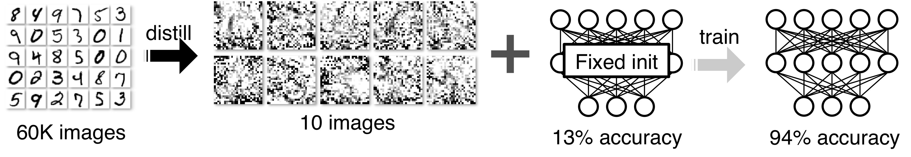

<!-- center: 画像の中央寄せ -->

# Dataset Distillation

**for deep learning study 2022**

B3 Aru Maekawa (@maekawa)

# Summary

- I tried **"Dataset Distillation"** for deep learning study 2022.
- I give an overview of dataset distillation and demonstrate my experimental results.
- I share the knowledge learned through the implementation of the experiments.

# Experiment Summary

### Dataset

**AG News**: Text Classification (4 classes $\times$ 30,000 text $=$ 120,000 text)

### Model

**DistilBERT**: (`distilbert-base-uncased` 6-layer, 768-hidden, 12-heads, 66M params)

_Note: I chose DistilBERT only because it is small, “Distil” in “DistilBERT” has nothing to do with dataset distillation. (sorry for the confusion ...)_

# Experiment Summary

## Results of Full Data

| Dataset   | #Train samples | #GD steps | Accuracy(%) |
| :-------- | -------------: | --------: | ----------: |
| Full data |    $120{,}000$ | $7{,}500$ |      $94.7$ |

# Experiment Summary

## Results of Distilled Data

| Dataset                                                     | #Train samples |   #GD steps |         Accuracy(%) |
| :---------------------------------------------------------- | -------------: | ----------: | ------------------: |
| Full data                                                   |    $120{,}000$ |   $7{,}500$ |              $94.7$ |
| **Distilled data**                                          |    $\textbf 4$ | $\textbf 1$ | $\textbf{86.3±3.4}$ |
| **Distilled data +SL$_{\rm unrestricted}$ +AL$_{\rm CLS}$** |    $\textbf 4$ | $\textbf 1$ | $\textbf{90.7±0.2}$ |

# Introduction

# What is “Dataset Distillation”?

- Distill the knowledge from **a large training dataset** into **a small one**

- Dataset distillation aims to not optimize model parameters, but a **small/synthetic dataset** that can be used to **effectively train models**

# Why distill datasets?

- Distilled datasets can **reduce the time**, **energy consumption**, and **required storage space** for neural networks training.
- Examining distilled data may **help to a better understanding of the original dataset.**
- Distilled synthetic data can be used to **protect data privacy**.

# Related Works

# Dataset Distillation (1)

### Dataset Distillation (Wang et al., 2018)

- The paper proposing dataset distillation
- Distilled 60,000 MNIST images into just **10 synthetic images (1 per class)** and trained LeNet on them, achieving **94%** accuracy

# Dataset Distillation (2)

### Soft-Label Dataset Distillation and Text Dataset Distillation, (Sucholutsky et al., IJCNN 2021)

- Improve dataset distillation using **soft-labels**
- Extend dataset distillation to **distill text data**

### Data Distillation for Text Classification (Li et al., SIGIR 2021)

- Apply dataset distillation to several text classification datasets
- Distilled data with the size of **0.1%** of the original dataset achieves **90% performance** of the original

# (Apply to Continual Learning)

### Distilled Replay: Overcoming Forgetting through Synthetic Samples (Rosasco et al., 2021)

- Distill replay buffer of each previous class into 1 image for continual learning
- Their buffer distillation algorithm using **loss accumulation** for improving distillation

# Open Question

- It works well when the **initial model parameters are known** in training but becomes **very difficult** when **randomly initialized**.
- **No studies** applied to **transformer-based pretrained model** have been reported yet. (only to TextCNN or RNN in previous works)

# Methods

# Optimization for distilled data

- $\bm{X}=\{\bm{x}\}_{n=1}^N$ : Real data, $\tilde{\bm{X}}=\{\bm{\tilde{x}}\}_{m=1}^M (M<<N)$ : Distilled data
- $\bm\theta$ : Model (parameters), $\mathcal{L}(\cdot)$ : Loss function

**Objective of Common Supervised Learning**

$$
\bm\theta^*=\argmin_{\bm\theta}{\mathcal{L}(\bm{X}, \theta)}
$$

**Objective of Dataset Distillation**

# Apply mini-batch SGD

(ref. Wang et al., 2018)

<!-- _class: lead -->

**Inner step**: update model with distilled data

$$
\bm\theta_{t} = \bm\theta_{t-1}-\eta \frac{\partial \mathcal{L}(\tilde{\bm{X}},\bm\theta_{t-1})}{\partial \bm\theta_{t-1}} \quad ({\rm for} \; t\!=\!1,\!\cdots\!,\! T)
$$

**Outer step**: update distilled data

$$
\tilde{\bm{X}} \leftarrow \tilde{\bm{X}}-\alpha \frac{\partial \mathcal{L}(\bm{x}_s,\bm\theta_{T})}{\partial \tilde{\bm X}}
$$

**Loss Accumulation** (ref. Rosasco et al., 2021)

<!-- To improve the optimization of distilled data more efficiency, I used not just the loss after the last inner steps, but **the sum of the losses of all inner steps**. -->

$$
\mathcal{L}_{distill}=\sum_{t=1}^T\mathcal{L}_{distill}^{(t)}=\sum_{t=1}^T\mathcal{L}(\bm x_s, \bm\theta_{t})
$$

# Apply to Text Data

(ref. Sucholutsky et al., IJCNN 2021, Li et al., SIGIR 2021)

Unlike image data, text data **cannot** be optimized by **gradient methods** as it is **discrete**. so sequences of **embedding vectors** are used instead of text.

input_embeddings: Tensor(float) ($S×E$)

- $S$: sequence length
- $E$: embedding dimension

(In my experiments, I use embedding vectors that are input to the first transformer layer)

# Fixed/Random Initialization

### Fixed initialization

- **Initial model parameters are fixed between training and test**. In this setting, dataset distillation works very well.

### Random initialization

- **Randomly** initialized both training and test.

  (In my experiment, I used a pretrained model, so only last 2 linear layers are actually initialized randomly.)

# Experiments

# Settings

- **the size of distilled data for each class ($M$ / #classes): 1**
- **the number of inner steps ($T$): 1**
- learning rate for training model with distilled data ($\eta$): 5e-1
- learning rate for training distilled data ($\alpha$): 2e-3
- the number of epochs for training distilled data : 20
- max norm of gradient clipping for training distilled data : 1.0
- **dropout ratio ($p$): 0.0**

# Results

| Dataset                      | #Train samples |   #GD steps |           Accuracy(%) |
| :--------------------------- | -------------: | ----------: | --------------------: |
| Full data                    |    $120{,}000$ |   $7{,}500$ |                $94.7$ |
| Distilled data (fixed init.) |            $4$ |         $1$ |                $90.6$ |
| **Distilled data**           |    $\textbf 4$ | $\textbf 1$ | $\textbf{86.3±3.4}$\* |

\*Distilled data with random initialization test on 100 different initial parameter.

- Similar to previous works, dataset distillation **worked very well** for **fixed initial parameters** that achieve approximately **95%** of full data.
- It also achieved **91%** of full data even on **randomly initialized** settings.

# Soft-Labels

(ref. Sucholutsky et al., IJCNN 2021)

**hard**

- **fixed** **one-hot** encoding labels

**soft** (optimized)

- **restricted** to being a valid **probability distribution** (**non-negative**, **sums to 1**)
- initialized with the softmax function applied one-hot values

**unrestricted** (optimized)

- unrestricted real-valued vector (**allow even negative values**)
- initialized with one-hot values

# Experiment for Soft-Labels

**Results**

| Dataset                                     | #Train samples | #GD steps |         Accuracy(%) |
| :------------------------------------------ | -------------: | --------: | ------------------: |
| Full data                                   |    $120{,}000$ | $7{,}500$ |              $94.7$ |
| Distilled data                              |            $4$ |       $1$ |          $86.3±3.4$ |
| **Distilled data +SL**                      |            $4$ |       $1$ | $\textbf{87.1±1.4}$ |
| **Distilled data +SL$_{\rm unrestricted}$** |            $4$ |       $1$ | $\textbf{88.0±1.0}$ |

- This results shows that soft and unrestricted labels improved dataset distillation.
- I think unrestricted-labels work to indirectly **adjust the learning rate for each sample**.

# Attention Labels

My idea for improving dataset distillation inspired by supervised attention (Liu et al., 2016) and model distillation method using attention probability (Aguilar et al., 2020)

Add $\small{\lambda D_{KL}(\tilde A_{true}||A_{pred})}$ to loss in inner steps ($\lambda$ is weight factor for attention loss)

<!-- I tried 2-types of attention labels -->

- **only CLS token**
  - Attention labels for CLS token only
  - Tensor(float) ($L×H×S$)
- **all tokens**
  - Attention labels for all tokens in input sequence
  - Tensor(float) ($L×H×S×S$)

$L$: the number of layers, $H$: the number of heads, $S$: sequence length

# Experiment for Attention Labels

**Results** ($\lambda = 100$)

| Dataset                                                     | #Train samples | #GD steps |         Accuracy(%) |
| :---------------------------------------------------------- | -------------: | --------: | ------------------: |
| Full data                                                   |    $120{,}000$ | $7{,}500$ |              $94.7$ |
| Distilled data                                              |            $4$ |       $1$ |          $86.3±3.4$ |
| Distilled data +SL                                          |            $4$ |       $1$ |          $87.1±1.4$ |
| Distilled data +SL$_{\rm unrestricted}$                     |            $4$ |       $1$ |          $88.0±1.0$ |
| **Distilled data +SL$_{\rm unrestricted}$ +AL$_{\rm CLS}$** |            $4$ |       $1$ | $\textbf{90.7±0.2}$ |
| **Distilled data +SL$_{\rm unrestricted}$ +AL$_{\rm ALL}$** |            $4$ |       $1$ | $\textbf{90.3±0.4}$ |

# Experiment for multiple inner steps :weary:

**Results** (The number of inner steps : $T=1$ -> $T=3$)

| Dataset                                 | #Train samples |   #GD steps |         Accuracy(%) |
| --------------------------------------- | -------------: | ----------: | ------------------: |
| Distilled data                          |            $4$ |         $1$ |          $86.3±3.4$ |
| Distilled data                          |            $4$ | $\textbf 3$ | $\textbf{84.8±3.1}$ |
| Distilled data +SL                      |            $4$ |         $1$ |          $87.1±1.4$ |
| Distilled data +SL                      |            $4$ | $\textbf 3$ | $\textbf{84.9±2.7}$ |
| Distilled data +SL$_{\rm unrestricted}$ |            $4$ |         $1$ |          $88.0±1.0$ |
| Distilled data +SL$_{\rm unrestricted}$ |            $4$ | $\textbf 3$ | $\textbf{86.9±1.1}$ |

# Implementation

# Implementation

GitHub: https://github.com/arumaekawa/text-dataset-distillation

1. **How to calculate meta gradient**
1. **Training with Automatic Mixed Precision**
1. **Use \`logging\` and \`tqdm\` at the same time**
1. **pdb – Debugger for python**

# 1. How to calculate meta gradient

I refer to implementation of MAML

- torch.autograd.grad(create_graph=True)
- nn.Linear() -> F.linear()

Note: This is not best practice. I'm modifying the implementation now.

# 2. Training with Automatic Mixed Precision

pytorch module: `torch.cuda.amp`

- `amp.autocast()`
- `amp.GradScaler()`

### Docs

- https://pytorch.org/docs/stable/amp.html
- https://pytorch.org/docs/stable/notes/amp_examples.html

# 3. Use \`logging\` and \`tqdm\` at the same time

- tqdm: Visualize training progress
- You can use `tqdm.write()` instead of `print()` but this does not work when using logging.

See source code (`src/settings`)

# 4. pdb – Debugger for Python

`pdb.set_trace()`, (Python 3.7\~ : `breakpoint()`)

| commands            | actions                                      |
| ------------------- | -------------------------------------------- |
| `p(rint)`           | print variable                               |
| `a(rgs)`            | print arguments of the current function      |
| `n(ext)`, `s(tep)`  | execute the current line                     |
| `r(eturn)`          | execute until the current function returns   |
| `l(ist)`            | show source code around the current line     |
| any python commands | you can use any python commands like ipython |

# References

- Wang et al., 2018, _Dataset Distillation_ [[paper]](https://arxiv.org/abs/1811.10959)[[code]](https://github.com/SsnL/dataset-distillation)
- Sucholutsky et al., IJCNN 2021, _Soft-Label Dataset Distillation and Text Dataset Distillation_ [[paper]](https://ieeexplore.ieee.org/document/9533769)[[code]](https://github.com/ilia10000/dataset-distillation)
- Li et al., SIGIR 2021, _Dataset Distillation for Text Classification_ [[paper]](https://arxiv.org/abs/2104.08448)
- Rosasco et al., 2021 _Distilled Replay: Overcaming Forgetting through Synthetic Samples_ [[paper]](https://arxiv.org/abs/2103.15851)[[code]](https://github.com/andrearosasco/DistilledReplay)
- Li et al., 2016, _Neural Machine Translation with Supervised Attention_ [[paper]](https://aclanthology.org/C16-1291)
- Aguilar et al., 2020, _Knowledge Distillation from Internal Representations_ [[paper]](https://doi.org/10.1609/aaai.v34i05.6229)
